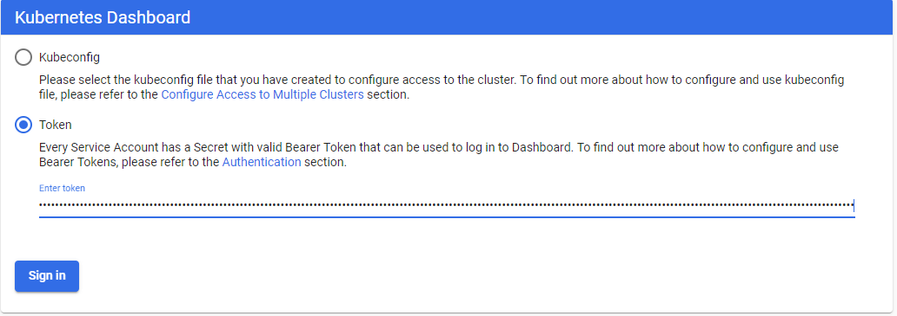
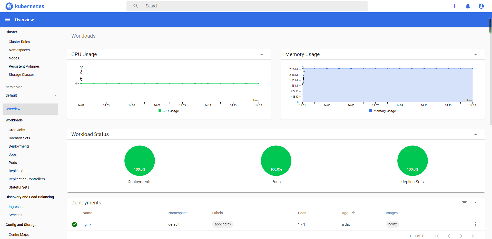

# 基于kubeadm搭建Kubernetes集群

一、环境准备
---
 1. 硬件配置信息如下所示：

|IP地址|节点角色|CPU|Memory|Hostname|磁盘|
| :------:| :------:| :------:| :------:| :------:| :------:|
|10.10.6.175 |worker |>=2c |>=2G|node1|sda、sdb|
|10.10.6.162 |master| >=2c|>=2G|master| sda、sdb|
|10.10.6.19 | worker|>=2c |>=2G|node2|sda、sdb|

 2. hostname设置
设置主机名hostname，管理节点设置主机名为 master ，其它节点用node1、node2即可。
``` 
hostnamectl set-hostname master
```
 3. 编辑 /etc/hosts 文件，添加域名解析
``` 
cat <<EOF >>/etc/hosts

10.10.6.162 master

10.10.6.175 node1

10.10.6.19 node2

EOF
``` 
 4. 关闭防火墙、selinux和swap
``` 
systemctl stop firewalld

systemctl disable firewalld

setenforce 0

sed -i "s/^SELINUX=enforcing/SELINUX=disabled/g" /etc/selinux/config

swapoff -a

sed -i 's/.*swap.*/#&/' /etc/fstab
``` 
 5. 配置内核参数，将桥接的IPv4流量传递到iptables的链
``` 
cat > /etc/sysctl.d/k8s.conf <<EOF

net.bridge.bridge-nf-call-ip6tables = 1

net.bridge.bridge-nf-call-iptables = 1

EOF

sysctl --system
``` 
 6. 配置国内yum源
``` 
yum install -y wget

mkdir /etc/yum.repos.d/bak && mv /etc/yum.repos.d/*.repo /etc/yum.repos.d/bak

wget -O /etc/yum.repos.d/CentOS-Base.repo http://mirrors.cloud.tencent.com/repo/centos7_base.repo

wget -O /etc/yum.repos.d/epel.repo http://mirrors.cloud.tencent.com/repo/epel-7.repo

yum clean all && yum makecache
``` 
配置Kubernetes源
``` 
cat <<EOF > /etc/yum.repos.d/kubernetes.repo

[kubernetes]

name=Kubernetes

baseurl=https://mirrors.aliyun.com/kubernetes/yum/repos/kubernetes-el7-x86_64/

enabled=1

gpgcheck=1

repo_gpgcheck=1

gpgkey=https://mirrors.aliyun.com/kubernetes/yum/doc/yum-key.gpg https://mirrors.aliyun.com/kubernetes/yum/doc/rpm-package-key.gpg

EOF
``` 

二、软件安装
---
 1. 安装docker
 2. 安装kubeadm、kubelet、kubectl
``` 
yum install -y kubelet kubeadm kubectl kubernetes-cni

systemctl enable kubelet
``` 
Kubelet负责与其他节点集群通信，并进行本节点Pod和容器生命周期的管理。Kubeadm是Kubernetes的自动化部署工具，降低了部署难度，提高效率。Kubectl是Kubernetes集群管理工具。

三、部署安装
---
 1. 在master进行Kubernetes集群初始化
``` 
kubeadm init --pod-network-cidr=10.244.0.0/16 --apiserver-advertise-address=10.10.6.162 --image-repository registry.aliyuncs.com/google_containers
``` 
集群初始化成功后返回如下信息：
记录生成的最后部分内容，此内容需要在其它节点加入Kubernetes集群时执行。
``` 
kubeadm join 10.10.6.162:6443 --token 1zdu3x.b98u9bbvg9x65ma5 --discovery-token-ca-cert-hash sha256:bac4f362f3d5bfd6975f0e91a4d6d6aca9a068fc6f8eaef4479a0ff4a0e07e76
``` 
 2. 在master配置kubectl工具
``` 
mkdir -p /root/.kube

cp /etc/kubernetes/admin.conf /root/.kube/config

kubectl get nodes

kubectl get cs
``` 
 3. 在master部署flannel网络
``` 
kubectl apply -f https://raw.githubusercontent.com/coreos/flannel/a70459be0084506e4ec919aa1c114638878db11b/Documentation/kube-flannel.yml
``` 
注意，这儿有坑，由于国内访问外网是被屏蔽了的，最好是先把kube-flannel.yml下载下来，把kube-flannel.yml中的quay.io修改为quay-mirror.qiniu.com。
 4. 部署node节点
在所有node节点上进行如下操作，执行如下命令，使所有node节点加入Kubernetes集群
``` 
kubeadm join 10.10.6.162:6443 --token 1zdu3x.b98u9bbvg9x65ma5 --discovery-token-ca-cert-hash sha256:bac4f362f3d5bfd6975f0e91a4d6d6aca9a068fc6f8eaef4479a0ff4a0e07e76
``` 

四、集群状态检测
---
 1. 在master节点输入命令检查集群状态，返回如下结果则集群状态正常
``` 
kubectl get nodes

NAME     STATUS   ROLES    AGE     VERSION
master   Ready    master   6h39m   v1.16.1
node19   Ready    <none>   6h36m   v1.16.2
wda      Ready    <none>   160m    v1.16.2

``` 
重点查看STATUS内容为Ready时，则说明集群状态正常。
 2. 创建Pod以验证集群是否正常
``` 
kubectl create deployment nginx --image=nginx
kubectl expose deployment nginx --port=80 --type=NodePort
kubectl get pod,svc
``` 
 3. 踩坑日志
- ubuntu 国内kubernetes源
``` 
cat <<EOF > /etc/apt/sources.list.d/kubernetes.list
deb http://mirrors.ustc.edu.cn/kubernetes/apt kubernetes-xenial main
EOF

``` 
配置完，进行apt-get update，但可能会提示签名无法验证的问题，如下图：

解决方法：
``` 
gpg --keyserver keyserver.ubuntu.com --recv-keys BA07F4FB
gpg --export --armor BA07F4FB | sudo apt-key add -
apt-get update
``` 
- master一直处于notready状态
1. failed to find plugin "portmap" in path [/opt/cni/bin]]
解决方法1：
``` 
apt-get install kubernetes-cni
``` 
解决方法2：
``` 
curl -LO https://github.com/containernetworking/plugins/releases/download/v0.8.2/cni-plugins-linux-amd64-v0.8.2.tgz
``` 
解压到/opt/cni/bin目录下，然后重启
``` 
systemctl daemon-reload 
``` 
2. plugin flannel does not support config version，修改配置文件
``` 
vim /etc/cni/net.d/10-flannel.conflist
//加上cni的版本号
//文件内容如下
{
  "name": "cbr0",
  "cniVersion": "0.2.0",
  "plugins": [
    {
      "type": "flannel",
      "delegate": {
        "hairpinMode": true,
        "isDefaultGateway": true
      }
    },
    {
      "type": "portmap",
      "capabilities": {
        "portMappings": true
      }
    }
  ]
}
``` 
- node1节点处于notready状态
解决办法：
``` 
到node1，查看kubectl日志，发现还是报错no valid networks found in /etc/cni/net.d将node1中也加上cni的版本号，重新启动，即可看到集群状态变为正常
``` 
- 常用命令
``` 
journalctl -xefu kubelet 
systemctl daemon-reload
systemctl restart kubelet
``` 
- kubeadm 添加工作节点
默认token的有效期为24小时，当过期之后，该token就不可用了。
``` 
产生token:
kubeadm token create
oapcal.mlearjiaijljtyeq
取ca证书sha256编码hash值：
openssl x509 -pubkey -in /etc/kubernetes/pki/ca.crt | openssl rsa -pubin -outform der 2>/dev/null | openssl dgst -sha256 -hex | sed 's/^.* //'
8832ca46fa644aa8d4864119430985875f27f29bc68dd86797e0b0fa4db60fb4

kubeadm join 10.10.6.162:6443 --token oapcal.mlearjiaijljtyeq --discovery-token-ca-cert-hash sha256:8832ca46fa644aa8d4864119430985875f27f29bc68dd86797e0b0fa4db60fb4
``` 
五、部署Dashboard
---
 1. 创建Dashboard的yaml文件
``` 
wget https://raw.githubusercontent.com/kubernetes/dashboard/v2.0.0-beta5/aio/deploy/recommended.yaml
``` 
``` 
增加直接访问端口
kind: Service
apiVersion: v1
metadata:
  labels:
    k8s-app: kubernetes-dashboard
  name: kubernetes-dashboard
  namespace: kubernetes-dashboard
spec:
  type: NodePort #增加
  ports:
    - port: 443
      targetPort: 8443
      nodePort: 30001 #增加
  selector:
    k8s-app: kubernetes-dashboard

因为自动生成的证书很多浏览器无法使用，所以我们自己创建，注释掉
kubernetes-dashboard-certs对象声明
#apiVersion: v1
#kind: Secret
#metadata:
#  labels:
#    k8s-app: kubernetes-dashboard
#  name: kubernetes-dashboard-certs
#  namespace: kubernetes-dashboard
#type: Opaque

``` 
 2. 部署Dashboard
``` 
#安装
kubectl create -f  ./recommended.yaml
#检查结果
kubectl get pods -A  -o wide
kubectl get service -n kubernetes-dashboard  -o wide
``` 
 3. 创建证书
``` 
# 创建key文件
openssl genrsa -out dashboard.key 2048

#证书请求
openssl req -days 36000 -new -out dashboard.csr -key dashboard.key -subj '/CN=dashboard-cert'

#自签证书
openssl x509 -req -in dashboard.csr -signkey dashboard.key -out dashboard.crt

#创建kubernetes-dashboard-certs对象
kubectl create secret generic kubernetes-dashboard-certs --from-file=dashboard.key --from-file=dashboard.crt -n kubernetes-dashboard
``` 
 4. 创建dashboard管理员
``` 
cat >> dashboard-admin.yaml<<EOF
apiVersion: v1
kind: ServiceAccount
metadata:
  labels:
    k8s-app: kubernetes-dashboard
  name: dashboard-admin
  namespace: kubernetes-dashboard
EOF

kubectl create -f dashboard-admin.yaml

为用户分配权限：
cat >>dashboard-admin-bind-cluster-role.yaml<<EOF
apiVersion: rbac.authorization.k8s.io/v1
kind: ClusterRoleBinding
metadata:
  name: dashboard-admin-bind-cluster-role
  labels:
    k8s-app: kubernetes-dashboard
roleRef:
  apiGroup: rbac.authorization.k8s.io
  kind: ClusterRole
  name: cluster-admin
subjects:
- kind: ServiceAccount
  name: dashboard-admin
  namespace: kubernetes-dashboard
EOF

kubectl create -f dashboard-admin-bind-cluster-role.yaml
``` 
 5. 安装metrics-server
下载
``` 
git clone https://github.com/kubernetes-incubator/metrics-server.git
``` 
修改metrics-server-deployment.yaml
``` 
k8s.gcr.io/metrics-server-amd64:v0.3.6修改为bluersw/metrics-server-amd64:v0.3.6
#在image: k8s.gcr.io/metrics-server-amd64 下添加一下内容
        command:
        - /metrics-server
        - --metric-resolution=30s
        - --kubelet-insecure-tls
        - --kubelet-preferred-address-types=InternalIP
查找runAsNonRoot: true  修改为runAsNonRoot: false
``` 
然后，执行kubectl create -f .
 6. 查看访问Dashboard的认证令牌
``` 
kubectl create serviceaccount  dashboard-admin -n kube-system
kubectl create clusterrolebinding  dashboard-admin --clusterrole=cluster-admin --serviceaccount=kube-system:dashboard-admin
kubectl describe secrets -n kube-system $(kubectl -n kube-system get secret | awk '/dashboard-admin/{print $1}')
``` 
 7. 使用输出的token登录Dashboard

认证通过后，登录Dashboard首页如图


六、部署Ingress-nginx
---
 1. 简介
Pod的IP以及service IP只能在集群内访问，如果想在集群外访问kubernetes提供的服务，可以使用nodeport、proxy、loadbalacer以及ingress等方式，由于service的IP集群外不能访问，就是使用ingress方式再代理一次，即ingress代理service，service代理pod.
Ingress基本原理图如下：

 2. 部署nginx-ingress-controller
下载nginx-ingress-controller配置文件
``` 
https://raw.githubusercontent.com/kubernetes/ingress-nginx/master/deploy/static/mandatory.yaml
``` 
 将镜像路径
``` 
image: quay.io/kubernetes-ingress-controller/nginx-ingress-controller:0.26.1
``` 
修改为
``` 
image: registry.aliyuncs.com/google_containers/nginx-ingress-controller:0.26.1
``` 
执行yaml文件部署
``` 
kubectl create -f ./mandatory.yaml
```
 3.  部署service用于对外提供服务
``` 
wget https://raw.githubusercontent.com/kubernetes/ingress-nginx/master/deploy/static/provider/baremetal/service-nodeport.yaml
``` 
修改service文件，指定一下nodePort，使用80端口和443端口作为nodePort，修改后的配置文件如下
``` 
apiVersion: v1
kind: Service
metadata:
  name: ingress-nginx
  namespace: ingress-nginx
  labels:
    app.kubernetes.io/name: ingress-nginx
    app.kubernetes.io/part-of: ingress-nginx
spec:
  type: NodePort
  ports:
    - name: http
      port: 80
      targetPort: 80
      protocol: TCP
      nodePort: 80   # http请求对外映射80端口
    - name: https
      port: 443
      targetPort: 443
      protocol: TCP
      nodePort: 443  # https请求对外映射443端口
  selector:
    app.kubernetes.io/name: ingress-nginx
    app.kubernetes.io/part-of: ingress-nginx

``` 
执行yaml
``` 
kubectl apply -f service-nodeport.yaml
``` 
查看ingress-nginx组件状态
``` 
root@master:/home/wda/k8s_demo# kubectl get pod -n ingress-nginx 
NAME                                       READY   STATUS    RESTARTS   AGE
nginx-ingress-controller-8bd99d95f-qqzps   1/1     Running   0          84m
root@master:/home/wda/k8s_demo# kubectl get svc -n ingress-nginx 
NAME            TYPE       CLUSTER-IP     EXTERNAL-IP   PORT(S)                      AGE
ingress-nginx   NodePort   10.97.215.46   <none>        80:30080/TCP,443:30443/TCP   76m
``` 

参考链接：
---

|序号|名称|
| :------:| :------|
|1 |[kubeadm init 后master一直处于notready状态](https://blog.csdn.net/wangmiaoyan/article/details/101216496) |
|2|[使用kubeadm安装Kubernetes 1.15](https://www.kubernetes.org.cn/5551.html) |
|3|[Kubernetes V1.16.2部署Dashboard V2.0(beta5)](https://blog.51cto.com/shunzi115/2447601) |
|4|[Ingress-nginx Installation Guide](https://github.com/kubernetes/ingress-nginx/blob/master/docs/deploy/index.md) |
|5|[kubernate部署nginx-ingress-controller以及定义ingress策略](https://blog.csdn.net/fuck487/article/details/102513554) |


 